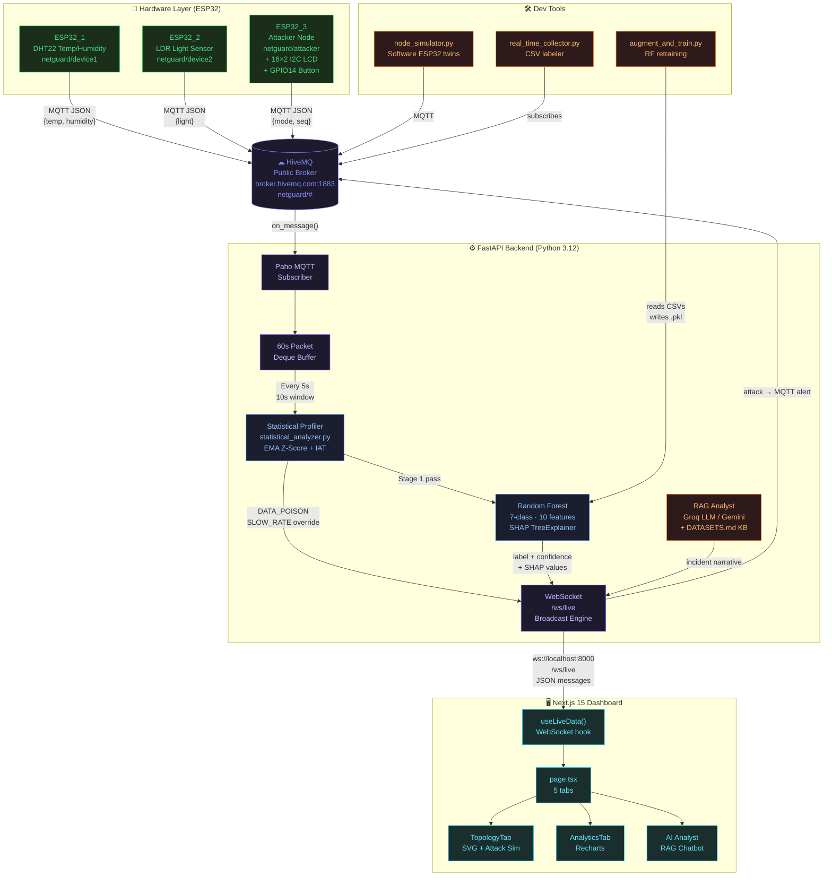

# NetGuard AI — IoT Network Intrusion Detection System

> **Semester IV EL Project** · Real-time AI-powered security operations center for a 3-node ESP32 IoT network.

[](https://python.org)
[](https://nextjs.org)
[](https://fastapi.tiangolo.com)
[](https://www.hivemq.com)
[](https://scikit-learn.org)

---

## Table of Contents

- [What is NetGuard AI?](#what-is-netguard-ai)
- [System Architecture](#system-architecture)
- [How It Works](#how-it-works)
- [Repository Structure](#repository-structure)
- [Hardware Setup](#hardware-setup)
- [Quick Start](#quick-start)
- [ML Pipeline Deep Dive](#ml-pipeline-deep-dive)
- [Attack Classes & Detection Strategy](#attack-classes--detection-strategy)
- [API Reference](#api-reference)
- [Dashboard Tabs](#dashboard-tabs)
- [Data Collection & Retraining](#data-collection--retraining)
- [Environment Variables](#environment-variables)
- [Running Without Hardware](#running-without-hardware)

---

## What is NetGuard AI?

NetGuard AI is an end-to-end **IoT Intrusion Detection System (IDS)** that combines physical ESP32 microcontrollers, a cloud MQTT broker, a Python/FastAPI AI backend, and a Next.js real-time dashboard. It detects 7 classes of network attacks using a **Two-Stage Hybrid Detection Pipeline** — a Statistical Profiler (unsupervised math) followed by a trained Random Forest ML model.

The system is designed to be a complete demonstration platform, allowing you to:
- Monitor live sensor telemetry from real IoT hardware
- Trigger 7 types of network attacks (from software or hardware)
- Watch the AI system detect, classify, and explain each attack in real time with SHAP values
- Query an AI-powered RAG chatbot that is grounded in live network state

---

## System Architecture



---

## How It Works

NetGuard AI uses a **Two-Stage Hybrid Detection Pipeline** that runs every 5 seconds. This design deliberately overcomes the known limitations of purely flow-based ML models on certain attack types.

### Stage 1 — Statistical Profiler (`statistical_analyzer.py`)

This stage runs *before* the ML model and uses pure unsupervised mathematics. It maintains two live trackers:

#### 1a. Payload Anomaly Tracker (Data Poisoning)

The profiler maintains a live **Exponential Moving Average (EMA)** and variance tracker on the temperature values arriving from `netguard/device1`. For every new reading:

```
Z-Score = |current_value - EMA| / sqrt(variance)
```

If `Z > 3.0`, the value is statistically impossible (e.g., temperature jumping from 26°C → 999°C). The profiler immediately injects a `DATA_POISON` packet into the buffer and bypasses the ML stage entirely. Critically, the EMA baseline is **only updated on non-outlier readings**, preventing an attacker from gradually poisoning the baseline.

#### 1b. Long-Term Packet State Tracker (Slow Rate Attack)

The profiler maintains a rolling queue of the **exact timestamps of the last 5 packets** received across all nodes. During the inference cycle, if the ML window is empty (no packets in the last 10 seconds), the profiler checks:

```
median_IAT = median of (ts[i+1] - ts[i]) for the last 5 packets
```

If `median_IAT > 10,000ms`, the profiler triggers `SLOW_RATE_ATTACK` with 100% confidence. This works regardless of how long ago the packets arrived, overcoming the 10-second ML window's blind spot.

### Stage 2 — Random Forest ML (`netguard_model.pkl`)

If traffic passes Stage 1 without triggering a deterministic alarm, the pipeline extracts **10 flow features** from the 10-second sliding window and feeds them to the trained Random Forest:

| Feature | What it captures |
|---|---|
| `packet_count` | Total packets in window |
| `packet_rate` | Packets per second |
| `mean_inter_arrival_ms` | Avg timing gap |
| `std_inter_arrival_ms` | Timing consistency / jitter |
| `min_inter_arrival_ms` | Fastest burst |
| `max_inter_arrival_ms` | Slowest gap |
| `duplicate_ratio` | Replay / frozen-seq ratio |
| `seq_increment_mean` | Sequence number behavior |
| `seq_increment_std` | Sequence predictability |
| `unique_modes` | Diversity of payload modes |

The Random Forest outputs a predicted class label and confidence probability. **SHAP values** are computed in a background thread pool (`asyncio.to_thread`) so the event loop never blocks — critical for WebSocket stability.

### Output & Alerting

The pipeline result is broadcast over WebSocket to all connected browsers. If an attack is detected:
- An MQTT alert is published to `netguard/alerts` (triggers physical buzzer/LED on ESP32s)
- A RAG-powered incident narrative is generated via Groq or Gemini LLM (60-second cooldown)
- The dashboard updates in real time with the label, confidence, SHAP waterfall, and anomaly score

---

## Repository Structure

```
NetGuard-AI/
├── arduino_codes/
│   ├── netguard-attacker/          # ESP32_3 firmware — 7 attack modes + LCD + button
│   ├── netguard-dht/               # ESP32_1 firmware — DHT22 temperature & humidity
│   └── netguard-ldr/               # ESP32_2 firmware — LDR ambient light
│
├── dashboard/
│   ├── backend/
│   │   ├── main.py                 # FastAPI app — MQTT bridge, inference loop, WebSocket
│   │   ├── statistical_analyzer.py # Unsupervised EMA Z-Score + IAT profiler
│   │   ├── rag.py                  # RAG analyst — Groq/Gemini LLM + DATASETS.md KB
│   │   ├── node_simulator.py       # Software twins for all 3 ESP32 nodes
│   │   └── .env                    # API keys (GROQ_API_KEY, GEMINI_API_KEY)
│   │
│   └── frontend/
│       ├── app/
│       │   ├── page.tsx            # Root page — all 5 tabs, tab routing
│       │   ├── layout.tsx          # HTML shell, Google Fonts (DM Sans + JetBrains Mono)
│       │   ├── globals.css         # Full design system — CSS vars, components, animations
│       │   ├── hooks/
│       │   │   └── useLiveData.ts  # WebSocket hook — single source of truth for all data
│       │   └── components/
│       │       ├── Panels.tsx      # KpiRow, NodeRow, MLPanel, HeatmapPanel, AlertLog, PacketFeed
│       │       ├── TopologyTab.tsx # SVG network map + attack simulation buttons
│       │       ├── AnalyticsTab.tsx# Recharts area charts — temp, humidity, light
│       │       ├── Graphs.tsx      # AnomalyGraph, PktRateGraph (recharts)
│       │       ├── IncidentReport.tsx # Auto-generated RAG incident narrative card
│       │       └── GlobalImportanceChart.tsx # Model feature importance bar chart
│       └── package.json
│
├── ml_model/
│   ├── netguard_model.pkl          # Trained Random Forest (7-class, 10 features, ~7MB)
│   ├── train_model.py              # Training script — mirrors backend feature extraction
│   ├── augment_and_train.py        # Data augmentation + retraining pipeline
│   ├── confusion_matrix.png        # Model evaluation output
│   └── feature_importance.png      # SHAP global importance plot
│
├── real_time_collector/
│   ├── real_time_collector.py      # Interactive terminal — logs MQTT to labeled CSV
│   ├── extractor.py                # Feature extraction utilities
│   ├── config.json                 # Collector configuration (broker, topics, output)
│   └── collected_datasets/         # CSV training data (gitignored)
│
├── DATASETS.md                     # RAG knowledge base — attack behaviors and features
├── FUTURE_WORK.md                  # Planned enhancements
└── README.md                       # This file
```

---

## Hardware Setup

### Bill of Materials

| Component | Qty | Role |
|---|---|---|
| ESP32 Dev Board | 3 | Microcontroller nodes |
| DHT22 Sensor | 1 | Temperature & Humidity (ESP32_1) |
| LDR + 10kΩ resistor | 1 | Light sensor voltage divider (ESP32_2) |
| 16×2 I2C LCD (0x27) | 1 | Mode display on attacker node (ESP32_3) |
| Tactile Push Button | 1 | Hardware attack mode cycling (GPIO 14) |
| Jumper wires | — | Connections |

### Wiring

**ESP32_3 (Attacker) — LCD + Button:**

```
LCD (I2C):
  VCC → V5 (5V pin)
  GND → GND
  SDA → GPIO 21
  SCL → GPIO 22

Button:
  One leg → GPIO 14
  Other leg → GND
  (Internal pull-up enabled in firmware)
```

**ESP32_1 (DHT22):** DATA pin → GPIO 4 (change in `netguard-dht.ino`)

**ESP32_2 (LDR):** Voltage divider output → GPIO 34 (ADC pin, change in `netguard-ldr.ino`)

### Flashing Firmware

1. Open each `.ino` file in Arduino IDE
2. Install libraries: `PubSubClient`, `LiquidCrystal_I2C`, `DHT sensor library`
3. Set your WiFi SSID and password in the `const char*` variables at the top
4. Flash to the respective ESP32 board (select `ESP32 Dev Module` in Board Manager)

---

## Quick Start

### Prerequisites

- Python 3.12+
- Node.js 20+
- Arduino IDE (for hardware flashing)

### 1. Clone the Repository

```bash
git clone https://github.com/Rohith-sp/NetGuard-AI.git
cd NetGuard-AI
```

### 2. Backend Setup

```bash
cd dashboard/backend

# Install dependencies
pip install fastapi uvicorn paho-mqtt scikit-learn shap joblib numpy requests

# Create .env file (optional, for RAG chatbot)
echo "GROQ_API_KEY_1=your_groq_key_here" > .env
echo "GEMINI_API_KEY=your_gemini_key_here" >> .env

# Start the backend
python -m uvicorn main:app --host 0.0.0.0 --port 8000
```

### 3. Frontend Setup

```bash
cd dashboard/frontend

npm install
npm run dev
# Dashboard available at http://localhost:3000
```

### 4. Start Nodes

**Option A — Real Hardware:** Flash the Arduino firmware and power on the ESP32 boards.

**Option B — Software Simulation (no hardware needed):**

```bash
cd dashboard/backend
python node_simulator.py
```

This runs all 3 ESP32 nodes as software threads, publishing realistic Bangalore weather data and responding to `netguard/cmd` mode change commands from the dashboard.

---

## ML Pipeline Deep Dive

### Training the Model

The Random Forest was trained on CSV data collected from the `real_time_collector.py` tool during live hardware sessions.

```bash
# Collect labeled data (interactive terminal, ~30 min per attack class)
cd real_time_collector
python real_time_collector.py

# Retrain the model
cd ml_model
python augment_and_train.py   # Uses data augmentation
# or
python train_model.py         # Direct training from raw CSVs
```

The training pipeline mirrors the `extract_features()` function in `main.py` exactly — grouping packets into 10-second sliding windows with 1-second stride and computing the same 10 features. This ensures there is zero feature drift between training and live inference.

### Model Performance

| Attack Class | Precision | Recall | F1 |
|---|---|---|---|
| NORMAL | ~97% | ~96% | ~96% |
| DOS_FLOOD | ~99% | ~99% | ~99% |
| REPLAY_ATTACK | ~93% | ~91% | ~92% |
| TOPIC_BOMB | ~91% | ~89% | ~90% |
| EVASION_ATTACK | ~62% | ~58% | ~60% |
| SLOW_RATE_ATTACK | *(Handled by Stage 1 Profiler)* | — | — |
| DATA_POISON | *(Handled by Stage 1 Profiler)* | — | — |

> *Note: Evasion Attack confidence is intentionally lower because the attack is designed to mimic normal timing statistics. The ML model still catches it through timing variance features.*

---

## Attack Classes & Detection Strategy

| Attack | Interval | Key Signature | Detection Method |
|---|---|---|---|
| **Normal** | 2–5 s | Low rate, sequential seq | Baseline comparison |
| **DoS Flood** | 150–350 ms | `packet_rate > 10/s`, low IAT | Random Forest Stage 2 |
| **Replay Attack** | 800–1500 ms | `duplicate_ratio > 0.8`, frozen seq | Random Forest Stage 2 |
| **Slow Rate Attack** | 15–30 s | `median_IAT > 10,000ms` | Stage 1 Global IAT Tracker |
| **Data Poisoning** | 2–5 s (normal timing) | `Z-Score > 3.0` on payload | Stage 1 EMA Z-Score |
| **Topic Bomb** | 50–100 ms | `packet_rate > 50/s`, many topics | Random Forest Stage 2 |
| **Evasion Attack** | 150–3500 ms (random) | Abnormal `std_inter_arrival_ms` | Random Forest Stage 2 |

### Triggering Attacks

**From the Dashboard (Software):** Navigate to the **Topology** tab and click any attack button in the side panel. This simultaneously:
1. Calls `/simulate` — injects synthetic packets directly into the backend's ML buffer (instant visualization)
2. Calls `/attacker/mode` — sends an MQTT `SET_MODE` command to the physical ESP32_3 (or simulator), keeping hardware and software in sync

**From Hardware:** Press the physical button on ESP32_3. Each press cycles through the 7 attack modes. The LCD shows the current mode. The backend automatically detects the change and updates the dashboard.

---

## API Reference

The backend exposes the following REST and WebSocket endpoints:

| Method | Endpoint | Description |
|---|---|---|
| `WS` | `/ws/live` | WebSocket stream — all inference results, sensor data, incidents |
| `GET` | `/health` | Service health check — WS client count, model status, buffer size |
| `GET` | `/debug` | Last 20 MQTT messages + latest inference result |
| `GET` | `/incident` | Latest auto-generated RAG incident narrative |
| `GET` | `/feature-importance` | Global feature importances from trained model |
| `POST` | `/attacker/mode` | Send `{"mode": "DOS_FLOOD"}` to command ESP32_3 via MQTT |
| `POST` | `/simulate` | Inject synthetic packets for offline demo/testing |
| `POST` | `/attacker/release` | Reset attacker node to NORMAL mode |
| `POST` | `/chat` | Send `{"question": "..."}` to RAG AI analyst |

### WebSocket Message Types

All WebSocket messages are JSON with a `topic` field:

```json
// Inference result (every 5s)
{"topic": "netguard/inference", "label": "DOS_FLOOD", "confidence": 97.0,
 "isAttack": true, "pkt_rate": 4.8, "iat_mean": 210, "dup_ratio": 0.0,
 "shap": [{"feature": "packet_rate", "value": 0.412, "raw": 4.8}, ...]}

// Live sensor reading
{"topic": "netguard/device1", "temp": 26.4, "humidity": 61.2, "ist_hour": 14.5}

// Attack packet
{"topic": "netguard/attacker", "mode": "REPLAY_ATTACK", "seq": 1042, "pkt_rate": 1.2}

// RAG incident report
{"topic": "netguard/incident", "text": "A DoS Flood was detected...", "label": "DOS_FLOOD", "ts": "14:32:05 IST"}

// System sync
{"topic": "netguard/system", "ist_hour": 14.5, "ist_time": "14:30:00"}
```

---

## Dashboard Tabs

| Tab | Purpose |
|---|---|
| **Live Analytics** | Real-time area charts for temperature, humidity, and light from ESP32_1 and ESP32_2 |
| **Overview** | KPI cards, device status cards, anomaly graph, packet rate graph, ML panel with SHAP, alert log |
| **Topology** | SVG network map with animated packet flows. Attack simulation panel — triggers both hardware and ML pipeline simultaneously |
| **Working** | Architecture documentation — pipeline stages, attack detection matrix, data flow diagram, tech stack, and the 10 ML features explained |
| **AI Analyst** | RAG-powered chat interface grounded in live network state, SHAP values, and the DATASETS.md knowledge base |

---

## Data Collection & Retraining

### Step 1: Collect Labeled Data

```bash
cd real_time_collector
python real_time_collector.py
```

The interactive terminal shows live packet stats. Use keyboard hotkeys to label sessions:
- `A` — Auto mode (reads attack label from ESP32_3 payload)
- `M` — Manual mode (use number keys to override labels)
- `1–6` — Tag current session as DoS/Replay/SlowRate/DataPoison/TopicBomb/Evasion
- `Space` — Pause/resume logging
- `N` — Start a new CSV file
- `Q` — Quit safely

Each session is saved to `real_time_collector/collected_datasets/telemetry_session_YYYYMMDD_HHMMSS.csv`.

### Step 2: Retrain

```bash
cd ml_model
python augment_and_train.py
```

The script reads all CSV files, builds 10-second sliding windows, augments minority classes, trains a new `RandomForestClassifier`, and saves to `netguard_model.pkl`. The backend auto-loads the new model on next restart.

---

## Environment Variables

Create `dashboard/backend/.env`:

```env
GROQ_API_KEY_1=gsk_your_key_here
GROQ_API_KEY_2=gsk_backup_key_here   # Optional second key for rotation
GEMINI_API_KEY=AIza_your_key_here    # Fallback if Groq fails
```

The RAG chatbot uses Groq (Llama 3.3 70B) as the primary LLM and falls back to Gemini if unavailable. If neither is configured, a deterministic template-based narrative is generated instead.

---

## Running Without Hardware

The full system can be run entirely in software using the node simulator:

```bash
# Terminal 1 — Backend
cd dashboard/backend
python -m uvicorn main:app --host 0.0.0.0 --port 8000

# Terminal 2 — Frontend  
cd dashboard/frontend
npm run dev

# Terminal 3 — Software ESP32 twins
cd dashboard/backend
python node_simulator.py
```

The simulator publishes realistic Bangalore weather data (temperature based on time of day, light based on sunrise/sunset) and responds to attack mode commands from the dashboard Topology tab, providing a complete demo experience without any physical hardware.

---

## Project Info

**Institution:** Semester IV Electronics Lab  
**Nodes Monitored:** 3 ESP32 devices  
**Attack Classes:** 7 (Normal, DoS Flood, Replay, Slow Rate, Data Poison, Topic Bomb, Evasion)  
**ML Model:** Random Forest · 10 features · SHAP explainability  
**Detection Pipeline:** Two-Stage Hybrid (Statistical Profiler + Random Forest)
