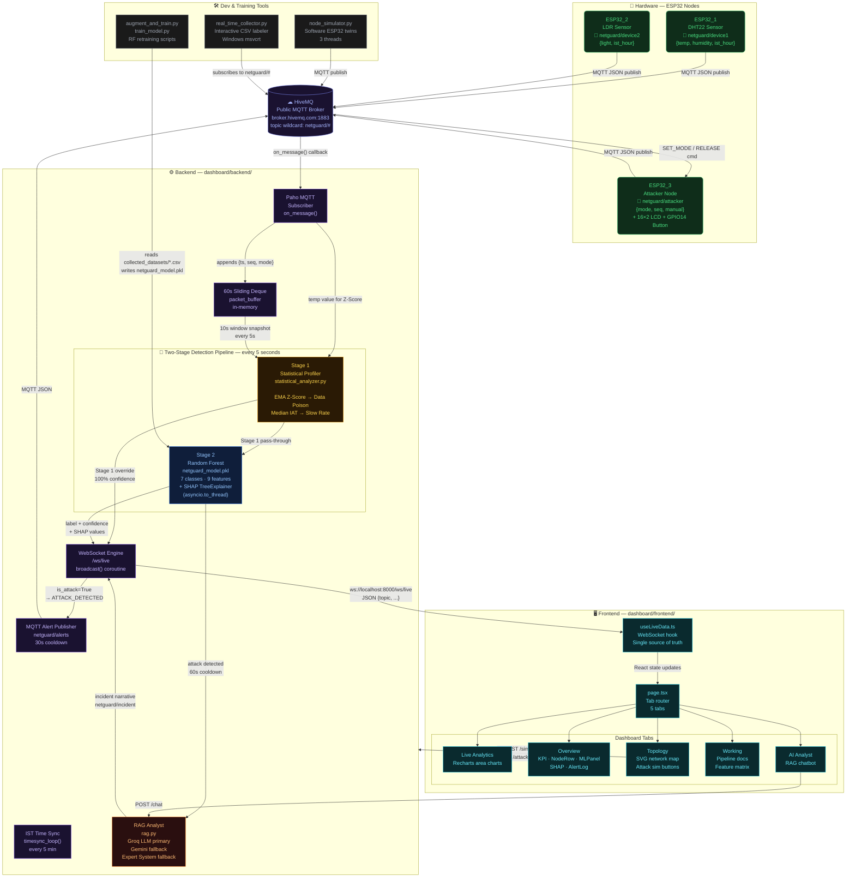

# NetGuard AI

> Real-time IoT Network Intrusion Detection System — a 3-node ESP32 network monitored by a Two-Stage Hybrid AI pipeline with a live SOC dashboard and explainable ML.

## Table of Contents

- [Overview](#overview)
- [Tech Stack](#tech-stack)
- [Architecture Overview](#architecture-overview)
- [Component Breakdown](#component-breakdown)
- [Data Flow](#data-flow)
- [API Reference](#api-reference)
- [Models & Schema](#models--schema)
- [Configuration](#configuration)
- [Setup & Installation](#setup--installation)
- [Project Structure](#project-structure)
- [Key Algorithms & Design Decisions](#key-algorithms--design-decisions)
- [Testing](#testing)
- [Deployment](#deployment)
- [Contributing](#contributing)
- [License](#license)

---

## Overview

NetGuard AI is a complete, end-to-end **IoT Intrusion Detection System (IDS)** built as a Semester IV Electronics Lab project. The system monitors a three-node ESP32 network (a DHT22 temperature/humidity sensor, an LDR light sensor, and a programmable attacker node) and uses machine learning to classify seven categories of network attack in real time.

The core challenge this project solves is that purely flow-based machine learning models fail on certain attack types. A **Slow Rate Attack** sends packets so infrequently that the standard 10-second monitoring window is often empty, making it look like normal idle time. A **Data Poisoning Attack** maintains perfectly normal timing while injecting physically-impossible sensor values — invisible to any flow feature. NetGuard AI addresses both with a **Two-Stage Hybrid Detection Pipeline**: a deterministic unsupervised Statistical Profiler runs before the ML model, using Exponential Moving Average (EMA) Z-Scores and long-term packet timestamp tracking to catch the attacks that ML cannot.

**Stage 1 (Statistical Profiler)** is the primary IDS — it performs real intrusion detection using unsupervised mathematical techniques that work regardless of whether the attacker self-identifies. **Stage 2 (Random Forest)** provides supplementary classification using 9 flow-based features (packet rate, inter-arrival times, sequence increments, duplicate ratio) — none of which rely on attacker-declared metadata.

What makes it notable is the combination of physical hardware, a cloud MQTT broker, a Python/FastAPI inference server, SHAP-explainable predictions, a Groq/Gemini RAG chatbot, and a production-quality Next.js dashboard — all deployed together as a unified demonstration platform. Attacks can be triggered from the hardware (a physical button on the ESP32) or from the dashboard's Topology tab, and both paths stay in perfect sync via WebSocket.

### Architecture Limitations

This is a **live-demo research prototype**, not production infrastructure:

- **Single-worker, in-memory** — `--workers 1` because of module-level globals (packet_buffer, profiler state). State does not survive a backend restart.
- **No persistence** — Alerts, incident narratives, and sensor history are held in Python dicts/deques. No database.
- **No horizontal scaling** — The design is inherently single-process.
- **MQTT broker** — During development, `broker.hivemq.com:1883` (public, unauthenticated) is used for convenience. Production deployments should use a private broker with TLS and ACLs. MQTT authentication/TLS is supported via environment variables (see Configuration section).
- **API authentication** — All mutation endpoints (`/attacker/mode`, `/simulate`, `/chat`, `/attacker/release`) require an `X-API-Key` header. The key is read from the `NETGUARD_API_KEY` environment variable (defaults to `changeme-dev-key` for local development).

---

## Tech Stack

| Layer | Technology | Purpose |
|---|---|---|
| Hardware | ESP32 × 3 | Microcontroller nodes for sensing and attack simulation |
| Sensor | DHT22 | Temperature and humidity (ESP32_1) |
| Sensor | LDR + 10kΩ divider | Ambient light in LUX (ESP32_2) |
| Display | 16×2 I2C LCD (0x27) | Shows current attack mode on ESP32_3 |
| Firmware | Arduino IDE, C++ | ESP32 firmware for all 3 nodes |
| Firmware Libs | PubSubClient, LiquidCrystal_I2C | MQTT client, I2C LCD driver |
| Protocol | MQTT over TCP | All node-to-backend communication |
| Broker | HiveMQ (public cloud) | Stateless MQTT broker — `broker.hivemq.com:1883` |
| Backend | Python 3.12, FastAPI, Uvicorn | REST + WebSocket inference server |
| MQTT Client | Paho MQTT | Backend-side broker subscription |
| ML | scikit-learn RandomForestClassifier | 7-class attack classification (9 flow-based features) |
| Explainability | SHAP TreeExplainer | Per-inference SHAP force values (additivity validated) |
| Unsupervised | Custom EMA + Z-Score | Payload anomaly detection (no retraining needed) |
| Security | API Key Auth, MQTT TLS | Protected endpoints, optional MQTT encryption |
| AI Analyst | Groq API (Llama 3.3 70B), Gemini API | RAG-grounded incident narratives and chat |
| Frontend | Next.js 15, React 19, TypeScript | SOC dashboard SPA |
| Charts | Recharts | Anomaly score, packet rate, sensor time-series |
| Styling | Vanilla CSS (design tokens) | Full custom design system — no Tailwind |
| Fonts | DM Sans, JetBrains Mono (Google Fonts) | Typography |
| Package Manager | npm | Frontend dependency management |
| Version Control | Git / GitHub | Source control |

---

## Architecture Overview



---

## Component Breakdown

### ESP32_1 — DHT22 Sensor Node
- **Location:** `arduino_codes/netguard-dht/`
- **Purpose:** Publishes temperature and humidity readings as MQTT JSON every 2–5 seconds.
- **Exposes:** Topic `netguard/device1` — `{device, temp, humidity, ist_hour, synced}`
- **Depends On:** HiveMQ broker; receives `netguard/timesync` for IST clock alignment
- **Key Logic:** Uses `random.uniform(2, 5)` inter-packet jitter to simulate realistic IoT behavior and reduce detection as a regular interval clock

---

### ESP32_2 — LDR Sensor Node
- **Location:** `arduino_codes/netguard-ldr/`
- **Purpose:** Publishes ambient light readings in LUX as MQTT JSON every 2–5 seconds.
- **Exposes:** Topic `netguard/device2` — `{device, light, ist_hour, synced}`
- **Depends On:** HiveMQ broker; `netguard/timesync` for time alignment
- **Key Logic:** Light value derived from ADC reading on a voltage divider (LDR + 10kΩ resistor to 3.3V)

---

### ESP32_3 — Attacker Node
- **Location:** `arduino_codes/netguard-attacker/netguard-attacker.ino`
- **Purpose:** Simulates 7 network attack modes on command, displaying the current mode on an I2C LCD.
- **Exposes:** Topic `netguard/attacker` — `{device, mode, seq, manual}`; subscribes to `netguard/cmd` and `netguard/alerts`
- **Depends On:** HiveMQ broker, `PubSubClient`, `LiquidCrystal_I2C`
- **Key Logic:**
  - A physical button on GPIO 14 cycles through attack modes via debounced interrupt (250ms ignore window)
  - `REPLAY_ATTACK` freezes the sequence number — every packet resends the first captured payload
  - `DATA_POISON` publishes to `netguard/device1` with spoofed `temp: 999°C` and `humidity: -100`
  - `TOPIC_BOMB` floods random `netguard/junk_XXXXXX` topics at 50–100ms intervals
  - `EVASION_ATTACK` randomizes delays between 150–3500ms to break timing-based ML features
  - LCD updates are throttled to every 500ms and use character overwrite instead of `lcd.clear()` to eliminate screen flicker

---

### FastAPI Backend — `main.py`
- **Location:** `dashboard/backend/main.py`
- **Purpose:** Central server — bridges MQTT to WebSocket, runs the Two-Stage Detection Pipeline every 5 seconds, publishes alerts, and serves the REST API.
- **Exposes:** `GET /health`, `GET /debug`, `GET /incident`, `GET /feature-importance`, `POST /attacker/mode`, `POST /simulate`, `POST /attacker/release`, `POST /chat`, `WS /ws/live`
- **Depends On:** `statistical_analyzer.py`, `rag.py`, `netguard_model.pkl`, HiveMQ broker, Paho MQTT
- **Key Logic:**
  - `packet_buffer` — a `collections.deque` holding raw attacker packets for the last 60 seconds, shared between the MQTT thread and the asyncio inference loop
  - `inference_loop()` — an `asyncio` background task that wakes every 5 seconds, snapshots the last 10 seconds of `packet_buffer`, calls the Two-Stage Pipeline, and broadcasts results
  - `asyncio.to_thread()` — the entire ML inference (Random Forest + SHAP) is offloaded to a thread pool executor to prevent blocking the event loop and causing WebSocket disconnects
  - `_last_alert_time` + 30-second cooldown prevents buzzer spam on sustained attacks
  - `_last_incident_time` + 60-second cooldown rate-limits RAG narrative generation
  - **API Authentication** — all mutation endpoints (`/attacker/mode`, `/simulate`, `/chat`, `/attacker/release`) require an `X-API-Key` header, validated against the `NETGUARD_API_KEY` env var
  - **MQTT Configuration** — broker, port, username, password, and TLS settings are all configurable via environment variables (see [Configuration](#configuration))

---

### Statistical Profiler — `statistical_analyzer.py`
- **Location:** `dashboard/backend/statistical_analyzer.py`
- **Purpose:** **Primary IDS** — unsupervised, zero-training anomaly detection engine for Data Poisoning and Slow Rate attacks. This is the only detection component that works regardless of attacker cooperation (does not rely on attacker self-identification). Runs as Stage 1 of the detection pipeline.
- **Exposes:** `StatisticalProfiler` class with `track_payload(temp)`, `track_packet(ts)`, `detect_slow_rate()`
- **Depends On:** Python standard library only (`math`, `collections.deque`)
- **Key Logic:**
  - **EMA Payload Tracker:** Maintains a running Exponential Moving Average (α=0.2) and variance for temperature readings. Z-Score = `|value - EMA| / sqrt(variance)`. The EMA baseline updates only on Z < 3.0 samples, preventing an attacker from gradually poisoning the statistical baseline itself.
  - **Global IAT Tracker:** Maintains a `deque(maxlen=5)` of the last 5 packet arrival timestamps across all node traffic. Computes the median inter-arrival time — if `median_IAT > 10,000ms` the system triggers `SLOW_RATE_ATTACK`. This works even when the ML's 10-second window is completely empty.

---

### RAG Analyst — `rag.py`
- **Location:** `dashboard/backend/rag.py`
- **Purpose:** Retrieval-Augmented Generation chatbot that answers security questions grounded in live network state, the last 50 MQTT logs, and the `DATASETS.md` knowledge base.
- **Exposes:** `query_analyst(question, logs, inference)` → `str`
- **Depends On:** Groq API, Gemini API (via `requests`), `DATASETS.md`
- **Key Logic:**
  - Primary: Calls Groq API with models tried in priority order: Llama 3.3 70B → Llama 3.1 70B → Llama3 70B → Llama 3.1 8B. Rotates across multiple API keys to handle rate limits (HTTP 429).
  - Fallback 1: Gemini API via `call_gemini_llm()`.
  - Fallback 2: `run_expert_system()` — a deterministic rule-based answer generator that produces formatted Markdown responses from the live inference dict, requiring no network calls.
  - System prompt injects the full `DATASETS.md` knowledge base, the latest ML inference result with SHAP values, and the last 50 MQTT log entries as grounding context.

---

### Node Simulator — `node_simulator.py`
- **Location:** `dashboard/backend/node_simulator.py`
- **Purpose:** Software twins of all three ESP32 nodes — runs without hardware and publishes realistic data to the MQTT broker.
- **Exposes:** Three daemon threads: `run_dht()`, `run_ldr()`, `run_attacker()`; subscribes to `netguard/cmd` to receive mode change commands from the dashboard
- **Depends On:** Paho MQTT, HiveMQ broker
- **Key Logic:**
  - Temperature uses `26.5 + 6.5 * sin((hour - 5.5) * π / 12)` — a sinusoidal model calibrated to Bangalore's real diurnal temperature cycle
  - Humidity and light use corresponding sinusoidal models with day/night transitions at 06:10 and 18:25 IST
  - The attacker thread maintains a `manual_lock` flag — once an attack mode is set, it stays until a `RELEASE` command, preventing auto-reversion during demos

---

### Real-Time Collector — `real_time_collector.py`
- **Location:** `real_time_collector/real_time_collector.py`
- **Purpose:** Interactive Windows terminal dashboard that subscribes to `netguard/#` and logs every packet to a timestamped CSV file for ML training.
- **Exposes:** Keyboard-driven CLI — mode labels, pause/resume, new session, quit
- **Depends On:** Paho MQTT, `msvcrt` (Windows-only non-blocking keyboard input)
- **Key Logic:**
  - Supports two labeling modes: `AUTO` (reads attack label from the attacker node's payload `mode` field) and `MANUAL` (operator overrides label via number keys 0–6)
  - Dashboard renders at 4Hz using ANSI escape codes, clearing the screen per-frame to prevent flicker
  - CSV schema: `timestamp_utc, topic, device, mode, seq, temp, humidity, light, inter_arrival_ms, label`

---

### ML Training Scripts
- **Location:** `ml_model/`
- **Purpose:** Train and serialize the Random Forest model from collected CSV data.
- **Exposes:** `netguard_model.pkl` — the serialized `RandomForestClassifier` with 7-class output
- **Depends On:** pandas, scikit-learn, joblib, matplotlib, seaborn, collected CSV files
- **Key Logic (`augment_and_train.py`):** Generates 200 synthetic `SLOW_RATE_ATTACK` packets (IAT 15–35 seconds) to augment real collected data, correcting class imbalance for the attack class that is hardest to collect. The synthetic distribution is calibrated to match real hardware behavior. Outputs confusion matrix heatmap, feature importance chart, and 5-fold stratified cross-validation scores.
- **Key Logic (`train_model.py`):** Groups packets into 10-second sliding windows with 1-second stride — **must mirror `extract_features()` in `main.py` exactly** to prevent feature drift between training and inference. Outputs confusion matrix, cross-validation scores, and feature importance plots.
- **Feature Schema:** 9 features (no `unique_modes` — removed to prevent label leakage). See [Models & Schema](#models--schema) for the full list.

---

### Frontend — Next.js Dashboard
- **Location:** `dashboard/frontend/`
- **Purpose:** Real-time SOC dashboard with 5 tabs for live monitoring, network visualization, system documentation, and AI-powered chat.
- **Exposes:** Web application at `http://localhost:3000`
- **Depends On:** Backend WebSocket at `ws://localhost:8000/ws/live`, REST API at `http://localhost:8000`
- **Key Files:**
  - `app/hooks/useLiveData.ts` — Single WebSocket connection with auto-reconnect (3s). Parses all message types by `topic` field and distributes state to all components. Exports `triggerAttack()` (hardware command) and `simulate()` (synthetic packet injection) as separate async functions.
  - `app/page.tsx` — Root component with tab routing. `simKey` is derived directly from `nodes.esp32_3.mode` (live WebSocket state) rather than local state, keeping hardware and software perfectly in sync.
  - `app/components/TopologyTab.tsx` — SVG network map with `animateMotion` packet dots. The simulation side panel triggers **both** `simulate()` and `triggerAttack()` simultaneously.
  - `app/globals.css` — Complete design system: CSS custom properties for colors, shadows, radii, typography; no utility framework.

---

## Data Flow

The following traces a complete path from an attacker pressing the hardware button to the dashboard showing the detection result.

1. **Hardware button press** — GPIO 14 (ESP32_3, `netguard-attacker.ino`). The debounced ISR cycles `currentMode` enum to `DOS_FLOOD`.

2. **MQTT publish** — ESP32_3's `loop()` calls `publishDOSFlood()`. Publishes `{"device":"esp32_3","mode":"DOS_FLOOD","seq":1042,"manual":true}` to `netguard/attacker` on HiveMQ at 150–350ms intervals.

3. **Broker routing** — HiveMQ matches the wildcard subscription `netguard/#` held by the FastAPI backend and forwards each packet.

4. **`on_message()` callback** (`main.py:345`) — Paho fires the callback on its internal thread. Packet is appended to `packet_buffer` deque as `{ts: float, seq: int, mode: str}`. The profiler's `track_packet(now)` is also called to log the global timestamp. The buffer is trimmed to the last 60 seconds.

5. **Frontend raw update** — A WebSocket message `{"topic":"netguard/attacker","mode":"DOS_FLOOD","seq":1042,"pkt_rate":4.8}` is immediately broadcast to all connected browsers, updating the ESP32_3 node card.

6. **`inference_loop()` wakes** (`main.py:150`) — The asyncio background task wakes every 5 seconds. It snapshots `packet_buffer` and filters packets within the last 10 seconds.

7. **`extract_features(window)`** (`main.py:109`) — Computes the 9-feature vector from the window. For a DoS flood: `packet_rate ≈ 4.8`, `mean_inter_arrival_ms ≈ 240`, `std_inter_arrival_ms ≈ 45`.

8. **Stage 1 — Statistical Profiler** — `profiler.detect_slow_rate()` returns False (median IAT is low, not high). No payload Z-Score alert (DoS packets don't go through `netguard/device1`). Stage 1 passes through.

9. **Stage 2 — Random Forest** (`main.py:188`) — `run_ml(feats)` is executed via `asyncio.to_thread`. The 9-feature numpy array is fed to `model.predict()`. Result: `DOS_FLOOD`, `99.0%` confidence. `EXPLAINER.shap_values(X)` produces per-feature attributions.

10. **`latest_inference` update** — The dict is updated with label, confidence, features, and SHAP values.

11. **WebSocket broadcast** (`main.py:228`) — `json.dumps({"topic":"netguard/inference","label":"DOS_FLOOD","confidence":99.0,"isAttack":true,...})` is sent to all connected `WebSocket` objects via `asyncio.run_coroutine_threadsafe(broadcast(out), _loop)`.

12. **MQTT alert** — Since `is_attack=True` and cooldown > 30s, `netguard/alerts` receives `{"source":"NetGuard-AI","type":"ATTACK_DETECTED","label":"DOS_FLOOD","confidence":99.0}`. The physical ESP32_3 buzzer fires.

13. **RAG incident** — Since cooldown > 60s, `_generate_incident_narrative()` is scheduled. Groq API is called with the system prompt injected with SHAP values and the DATASETS.md knowledge base. The generated narrative is broadcast as `{"topic":"netguard/incident",...}`.

14. **`useLiveData.ts` receives** — The `onmessage` handler parses the `netguard/inference` topic, updates `ml` state (label, confidence, SHAP array, pkt_rate, etc.). The anomaly score is computed as `isAttack ? confidence : 100 - confidence`.

15. **React re-render** — `MLPanel` shows `DOS_FLOOD · 99%` with the SHAP force plot bars. `AlertLog` prepends a `CRITICAL` severity alert. `AnomalyGraph` plots a new data point at y=99. The Topology tab's ESP32_3 node pulses red.

---

## API Reference

| Method | Endpoint | Auth | Description | Request Body | Response |
|---|---|---|---|---|---|
| `WS` | `/ws/live` | No | WebSocket stream — all real-time data | — | JSON messages (see below) |
| `GET` | `/health` | No | Service health check | — | `{status, ws_clients, model, buffer_size, ist_time}` |
| `GET` | `/debug` | No | Last 20 MQTT messages + latest inference | — | `{last_20_mqtt_messages, latest_inference}` |
| `GET` | `/incident` | No | Latest RAG incident narrative | — | `{text, label, ts}` |
| `GET` | `/feature-importance` | No | Global feature importances from model | — | `{features: [{feature, importance}], model_classes}` |
| `POST` | `/attacker/mode` | `X-API-Key` | Command ESP32_3 via MQTT `SET_MODE` | `{"mode": "DOS_FLOOD"}` | `{status, mode}` |
| `POST` | `/simulate` | `X-API-Key` | Inject synthetic packets into buffer | `{"mode": "SLOW_RATE_ATTACK"}` | `{status, mode, packets_injected}` |
| `POST` | `/attacker/release` | `X-API-Key` | Reset attacker to NORMAL | — | `{status}` |
| `POST` | `/chat` | `X-API-Key` | Query RAG AI analyst | `{"question": "Why is ESP32_3 flagged?"}` | `{reply: str}` |

### WebSocket Message Schema

All messages are JSON with a `topic` discriminator field:

```jsonc
// Inference result — published every 5 seconds
{
  "topic": "netguard/inference",
  "label": "DOS_FLOOD",        // string — 7-class prediction
  "confidence": 99.0,          // float — 0–100
  "isAttack": true,            // bool
  "pkt_rate": 4.8,             // float — packets/second
  "iat_mean": 210,             // int — milliseconds
  "dup_ratio": 0.0,            // float — 0.0–1.0
  "seq_gap": 1.0,              // float — mean seq increment
  "features": { ... },         // dict — all 9 raw features
  "shap": [                    // array — top SHAP attributions
    { "feature": "packet_rate", "value": 0.412, "raw": 4.8 }
  ]
}

// Attacker node packet (raw, per-packet)
{ "topic": "netguard/attacker", "mode": "DOS_FLOOD", "seq": 1042, "pkt_rate": 4.8, "iat": 0, "manual": true }

// DHT22 sensor reading
{ "topic": "netguard/device1", "temp": 26.4, "humidity": 61.2, "ist_hour": 14.5, "synced": true }

// LDR sensor reading
{ "topic": "netguard/device2", "light": 2100, "ist_hour": 14.5, "synced": true }

// RAG incident narrative
{ "topic": "netguard/incident", "text": "A DoS Flood was detected...", "label": "DOS_FLOOD", "ts": "14:32:05 IST" }

// System time sync
{ "topic": "netguard/system", "ist_hour": 14.5, "ist_time": "14:30:00" }
```

---

## Models & Schema

### `packet_buffer` Entry (in-memory deque)

```python
{
    "ts":   float,   # Unix epoch seconds (time.time())
    "seq":  int,     # Sequence number from attacker payload (-1 if absent)
    "mode": str,     # "NORMAL" | "DOS_FLOOD" | "REPLAY_ATTACK" | ...
}
```

### ML Feature Vector (9 features, ordered)

```python
FEATURE_COLS = [
    "packet_count",           # int   — packets in window
    "packet_rate",            # float — packets per second
    "mean_inter_arrival_ms",  # float — average IAT in milliseconds
    "std_inter_arrival_ms",   # float — standard deviation of IATs
    "min_inter_arrival_ms",   # float — minimum IAT
    "max_inter_arrival_ms",   # float — maximum IAT
    "duplicate_ratio",        # float — fraction of duplicate seq numbers (0.0–1.0)
    "seq_increment_mean",     # float — mean of (seq[i+1] - seq[i])
    "seq_increment_std",      # float — std dev of seq increments
]
# NOTE: unique_modes was removed to prevent label leakage.
# The attacker's self-declared "mode" field is NOT used as a feature.
# Detection relies on flow-based features that work regardless of attacker cooperation.
```

### `latest_inference` State Dict

```python
{
    "label":      str,    # Predicted class
    "confidence": float,  # 0–100
    "isAttack":   bool,
    "features":   dict,   # Raw feature values
    "shap":       list,   # [{feature, value, raw}, ...]
    "pkt_rate":   float,
    "iat_mean":   int,
    "dup_ratio":  float,
    "seq_gap":    float,
}
```

### Training CSV Schema

| Column | Type | Description |
|---|---|---|
| `timestamp_utc` | ISO-8601 string | UTC packet arrival timestamp |
| `topic` | string | MQTT topic (e.g., `netguard/attacker`) |
| `device` | string | `esp32_1`, `esp32_2`, or `esp32_3` |
| `mode` | string | Attack mode string from payload |
| `seq` | int | Sequence number (`-1` if absent) |
| `temp` | float | Temperature °C (`-1` if not applicable) |
| `humidity` | float | Humidity % (`-1` if not applicable) |
| `light` | int | Light in LUX (`-1` if not applicable) |
| `inter_arrival_ms` | int | Time since last packet from same device |
| `label` | string | Ground-truth class label |

### `StatisticalProfiler` Internal State

```python
{
    "temp_ema": float | None,    # Exponential Moving Average of temp (α=0.2)
    "temp_var": float,           # Running variance (starts at 1.0)
    "alpha":    0.2,             # EMA smoothing factor
    "global_packet_timestamps": deque(maxlen=5)  # Unix timestamps
}
```

---

## Configuration

### `dashboard/backend/.env`

| Variable | Default | Required | Description |
|---|---|---|---|
| `NETGUARD_API_KEY` | `changeme-dev-key` | Yes | API key for protecting mutation endpoints. **Change in production.** |
| `MQTT_BROKER` | `broker.hivemq.com` | No | MQTT broker hostname |
| `MQTT_PORT` | `1883` | No | MQTT broker port |
| `MQTT_USERNAME` | — | No | MQTT username for authenticated brokers |
| `MQTT_PASSWORD` | — | No | MQTT password for authenticated brokers |
| `MQTT_USE_TLS` | `false` | No | Set to `true` to enable TLS (port 8883 typically) |
| `MQTT_CA_CERTS` | — | No | Path to CA certificate file for TLS |
| `GROQ_API_KEY_1` | — | No | Primary Groq API key (Llama 3.3 70B). Get at console.groq.com |
| `GROQ_API_KEY_2` | — | No | Secondary Groq key for rate-limit rotation |
| `GROQ_API_KEY` | — | No | Generic fallback Groq key |
| `GEMINI_API_KEY` | — | No | Google Gemini API key — used if all Groq keys fail |

> If no API keys are configured, the RAG chatbot uses the built-in `run_expert_system()` deterministic fallback. All other system features work normally.

### `dashboard/frontend/.env.local`

| Variable | Default | Required | Description |
|---|---|---|---|
| `NEXT_PUBLIC_NETGUARD_API_KEY` | `changeme-dev-key` | Yes | Must match `NETGUARD_API_KEY` on the backend |

### API Authentication

All mutation endpoints require an `X-API-Key` header:

- `POST /attacker/mode` — Set attacker mode
- `POST /simulate` — Inject synthetic packets
- `POST /attacker/release` — Release attacker to NORMAL
- `POST /chat` — Query RAG analyst

```bash
# Example authenticated request
curl -X POST http://localhost:8000/attacker/mode \
  -H "Content-Type: application/json" \
  -H "X-API-Key: your-api-key" \
  -d '{"mode": "DOS_FLOOD"}'
```

### `real_time_collector/config.json`

```json
{
    "broker": "broker.hivemq.com",
    "port": 1883,
    "topics": {
        "netguard/device1": {"device_id": "esp32_1", "description": "DHT22 Node"},
        "netguard/device2": {"device_id": "esp32_2", "description": "LDR Node"},
        "netguard/attacker": {"device_id": "esp32_3", "description": "Attacker Node"}
    },
    "output_directory": "./collected_datasets",
    "default_label": "NORMAL"
}
```

### Arduino Firmware Constants (`netguard-attacker.ino`)

| Constant | Value | Description |
|---|---|---|
| `ssid` | `"ROHITH"` | WiFi network name — **change before flashing** |
| `password` | `"12345678"` | WiFi password — **change before flashing** |
| `mqtt_server` | `"broker.hivemq.com"` | MQTT broker hostname |
| `mqtt_port` | `1883` | MQTT broker port |
| `BUTTON_PIN` | `14` | GPIO pin for hardware attack mode button |
| `lcdUpdateInterval` | `500` | Minimum ms between LCD refreshes |

---

## Setup & Installation

### Prerequisites

- Python 3.12+
- Node.js 20+ and npm
- Arduino IDE 2.x (for hardware flashing only)
- Arduino libraries: `PubSubClient`, `LiquidCrystal_I2C`, `DHT sensor library by Adafruit`

### 1. Clone

```bash
git clone https://github.com/Rohith-sp/NetGuard-AI.git
cd "NetGuard-AI"
```

### 2. Backend

```bash
cd dashboard/backend

# Install Python dependencies
pip install fastapi uvicorn paho-mqtt scikit-learn shap joblib numpy requests matplotlib seaborn

# Create .env file (copy from example)
copy .env.example .env
# Edit .env to set:
#   NETGUARD_API_KEY=your-secret-key    (required for mutation endpoints)
#   MQTT_USERNAME / MQTT_PASSWORD       (if using an authenticated broker)
#   MQTT_USE_TLS=true                   (if using TLS)
#   GROQ_API_KEY_1=gsk_xxx              (optional, for RAG chatbot)

# Start the backend server
python -m uvicorn main:app --host 0.0.0.0 --port 8000
```

You should see:
```
[Env] Secure .env file loaded successfully.
[ML] Model loaded from ...netguard_model.pkl
[ML] Classes: ['DATA_POISON' 'DOS_FLOOD' 'EVASION_ATTACK' 'NORMAL' 'REPLAY_ATTACK' 'SLOW_RATE_ATTACK' 'TOPIC_BOMB']
[MQTT] Connected rc=0
[Startup] IST=14.52 | Model=loaded | MQTT=plain no-auth
```

### 3. Frontend

```bash
cd dashboard/frontend
npm install
npm run dev
```

Dashboard available at **http://localhost:3000**

### 4a. Hardware Nodes (Real ESP32s)

1. Open each `.ino` file in Arduino IDE
2. In `Tools → Board`, select `ESP32 Dev Module`
3. Edit the `ssid` and `password` constants at the top of each file to match your WiFi network
4. Install required libraries via `Tools → Manage Libraries`
5. Flash each board via USB (`Tools → Upload`)
6. Open Serial Monitor at 115200 baud to verify MQTT connection

### 4b. Software Simulation (No Hardware)

```bash
# In a separate terminal
cd dashboard/backend
python node_simulator.py
```

Output confirms all three nodes running:
```
[DHT] Running...
[LDR] Running...
[ATK] Running — waiting for trigger from dashboard...
```

### 5. Verify

Open http://localhost:3000. The `Live` indicator in the header should turn green. Navigate to `Overview` — all 3 node cards should appear `Online` within 5–10 seconds.

---

## Project Structure

```
NetGuard-AI/
│
├── arduino_codes/                     # ESP32 firmware (Arduino/C++)
│   ├── netguard-attacker/             # ESP32_3 — 7 attack modes, I2C LCD, GPIO button
│   ├── netguard-dht/                  # ESP32_1 — DHT22 temperature & humidity
│   └── netguard-ldr/                  # ESP32_2 — LDR ambient light sensor
│
├── dashboard/
│   ├── backend/                       # Python FastAPI inference server
│   │   ├── main.py                    # Entry point — MQTT, WebSocket, REST, inference loop
│   │   ├── statistical_analyzer.py    # Stage 1 — EMA Z-Score + IAT profiler (no ML)
│   │   ├── rag.py                     # RAG analyst — Groq/Gemini LLM + expert system
│   │   ├── node_simulator.py          # Software ESP32 twins (3 threaded nodes)
│   │   ├── debug_model.py             # Model debugging script
│   │   └── .env                       # API keys, MQTT config (gitignored)
│   │
│   └── frontend/                      # Next.js 15 SOC dashboard
│       ├── app/
│       │   ├── page.tsx               # Root component — tab router (5 tabs)
│       │   ├── layout.tsx             # HTML shell — Google Fonts, metadata
│       │   ├── globals.css            # Full CSS design system (tokens, components)
│       │   ├── hooks/
│       │   │   └── useLiveData.ts     # WebSocket hook — single source of truth
│       │   └── components/
│       │       ├── Panels.tsx         # KpiRow, NodeRow, MLPanel, HeatmapPanel, AlertLog, PacketFeed
│       │       ├── TopologyTab.tsx    # SVG network map + attack simulation controls
│       │       ├── AnalyticsTab.tsx   # Recharts area charts — temp, humidity, light
│       │       ├── Graphs.tsx         # AnomalyGraph, PktRateGraph (time-series)
│       │       ├── IncidentReport.tsx # RAG incident narrative display card
│       │       └── GlobalImportanceChart.tsx # Model feature importance chart
│       ├── .env.local                 # Frontend env vars (gitignored)
│       ├── package.json
│       └── next.config.ts
│
├── ml_model/
│   ├── netguard_model.pkl             # Serialized RandomForestClassifier (~7MB)
│   ├── augment_and_train.py           # Main training script — augments + trains
│   ├── train_model.py                 # Direct training from raw CSVs
│   ├── generate_plots.py              # Confusion matrix & feature importance plots
│   ├── generate_all_plots.py          # Full plot suite including SHAP beeswarm
│   ├── generate_new_shap_plots.py     # Local SHAP attribution plots
│   ├── confusion_matrix.png           # Model evaluation output
│   └── feature_importance.png         # Feature importance plot
│
├── real_time_collector/
│   ├── real_time_collector.py         # Interactive MQTT → CSV labeler (Windows)
│   ├── extractor.py                   # Feature extraction utilities
│   ├── config.json                    # Broker URL, topics, output directory
│   └── collected_datasets/            # CSV training data files (gitignored)
│
├── .env.example                       # Template for backend environment variables
├── DATASETS.md                        # RAG knowledge base — attack behavioral profiles
├── check_mqtt.py                      # Quick MQTT broker connectivity test
├── .gitignore
└── README.md
```

---

## Key Algorithms & Design Decisions

### Why a Two-Stage Pipeline?

A purely flow-based ML model computes features like `packet_rate` and `mean_inter_arrival_ms` over a fixed 10-second window. This creates two fatal blind spots:

- **Slow Rate Attack:** If packets arrive every 20 seconds, the 10-second window is empty for most cycles. The ML model sees zero packets — statistically identical to a sensor that is simply offline.
- **Data Poisoning:** The attacker publishes spoofed values (temperature: 999°C) but at the exact same normal timing as legitimate sensors. All flow features remain within perfectly normal ranges. The ML model is completely blind.

The Stage 1 Statistical Profiler solves both without retraining by operating on different dimensions — payload values and long-term packet history rather than short-window flow statistics.

### EMA Z-Score Baseline Protection

A naive Z-Score approach would compute `Z = |x - mean| / std` over a rolling window. An attacker who gradually escalates their payload values could shift the mean slowly enough to stay below the threshold. The NetGuard implementation prevents this by **freezing the EMA update when an outlier is detected** — the baseline only incorporates non-anomalous readings. This makes the baseline self-protective against gradual poisoning.

### `asyncio.to_thread` for ML Inference

The Random Forest model with a deep SHAP TreeExplainer can take 2–4 seconds on a Windows machine with a 7-class model. Running this synchronously in the `asyncio` event loop would block all WebSocket sends during inference, causing clients to timeout and disconnect (`[WS] Error {}`). Wrapping the ML block in `asyncio.to_thread(run_ml, feats)` offloads the CPU work to a thread pool executor while keeping the event loop free to handle pings, new connections, and other broadcasts.

### Hardware-Software Topology Sync

The Topology tab's `simKey` (which attack mode is highlighted in the UI) was previously a local React `useState`. This meant pressing the physical button on ESP32_3 had no effect on the UI state. The fix derives `simKey` directly from `nodes.esp32_3.mode` — live WebSocket state — so the UI automatically reflects hardware changes. The simulation buttons trigger both endpoints simultaneously: `/simulate` (injects packets instantly for demo responsiveness) and `/attacker/mode` (commands the real hardware for live deployment), keeping both paths always in sync.

### LCD Flicker Fix

The initial firmware called `lcd.clear()` before each update, causing the I2C LCD to blink visibly at 2Hz during normal operation. The fix replaces `lcd.clear()` with character-level overwriting — each line is padded with trailing spaces to overwrite previous content. Combined with a 500ms throttle on LCD updates, this eliminates all visible flicker even during high-rate attack modes.

### Thread-Safe Packet Buffer

`packet_buffer` is a `collections.deque` mutated by the Paho MQTT callback thread and read by the `asyncio` inference loop. Rather than adding a lock (which could cause deadlocks across thread boundaries), the inference loop makes a defensive copy with `list(packet_buffer)` inside a `try/except RuntimeError`. A `RuntimeError` from concurrent mutation is caught and the inference tick is simply skipped, accepting one missed cycle over risking a deadlock.

### RAG Fallback Hierarchy

The RAG analyst implements a three-level fallback to guarantee a response under all network conditions:
1. **Groq API** — tries multiple models and multiple API keys to handle rate limits
2. **Gemini API** — fallback if all Groq keys are exhausted
3. **Expert System** — deterministic rule-based responses compiled from the live inference dict, requiring zero network access

---

## Testing

The project does not currently have a dedicated automated test suite.

**Manual verification procedure:**

```bash
# 1. Verify backend health
curl http://localhost:8000/health

# 2. Verify ML model and SHAP are working (requires API key)
curl -X POST http://localhost:8000/simulate \
  -H "Content-Type: application/json" \
  -H "X-API-Key: your-api-key" \
  -d "{\"mode\":\"DOS_FLOOD\"}"
# Wait 5 seconds, then:
curl http://localhost:8000/debug
# Expected: latest_inference.label == "DOS_FLOOD"

# 3. Verify WebSocket
# Open browser → http://localhost:3000 → check Live indicator turns green

# 4. Verify RAG chatbot (requires API key)
curl -X POST http://localhost:8000/chat \
  -H "Content-Type: application/json" \
  -H "X-API-Key: your-api-key" \
  -d "{\"question\":\"What attack is active?\"}"
```

**Attack coverage manual checklist:**

| Attack | Trigger | Expected Label |
|---|---|---|
| DoS Flood | Topology tab → DoS Flood button | `DOS_FLOOD` in ≤10s |
| Replay | Topology tab → Replay button | `REPLAY_ATTACK` in ≤10s |
| Topic Bomb | Topology tab → Topic Bomb | `TOPIC_BOMB` in ≤10s |
| Evasion | Topology tab → Evasion | `EVASION_ATTACK` in ≤15s |
| Slow Rate | Topology tab → Slow-Rate | `SLOW_RATE_ATTACK` (Stage 1) in ≤60s |
| Data Poison | Topology tab → Data Poison | `DATA_POISON` (Stage 1) in ≤10s |

---

## Deployment

The project is designed for local/LAN deployment during a hardware demonstration. There is no containerization currently configured.

### Production-like local deployment

```bash
# Backend (foreground with logs)
cd dashboard/backend
python -m uvicorn main:app --host 0.0.0.0 --port 8000 --workers 1

# Frontend (production build)
cd dashboard/frontend
npm run build
npm start   # serves on port 3000
```

> **Note:** `--workers 1` is required because `packet_buffer`, `latest_inference`, and `connected_ws` are module-level global variables. Multiple workers would each have independent state and the buffer would not be shared.

### Network Configuration

For multi-device demos (laptop + phone on same WiFi):

1. Replace `ws://localhost:8000` in `useLiveData.ts` with the laptop's LAN IP (e.g., `ws://192.168.1.42:8000`)
2. Replace `http://localhost:8000` references in `page.tsx` similarly
3. Run `python -m uvicorn main:app --host 0.0.0.0 --port 8000`

### Future Docker Deployment [TODO: confirm]

A `docker-compose.yml` has not been created yet. A minimal configuration would need:
- Python 3.12 container for the backend
- Node 20 container for the frontend build
- No database container required (all state is in-memory)

---

## Contributing

### Branch Strategy

- `main` — stable, deployable state
- Feature branches: `feat/<description>` (e.g., `feat/deep-packet-inspection`)
- Bug fixes: `fix/<description>`

### PR Process

1. Fork or branch from `main`
2. Make changes and test manually using the procedure in the Testing section
3. Ensure `python -m uvicorn main:app` starts without errors
4. Ensure `npm run build` in `dashboard/frontend` completes without TypeScript errors
5. Open a PR with a description of changes and which attack classes were tested

### Code Style

- **Python:** Follow PEP 8. Use type hints on all new function signatures. Comment all non-obvious algorithmic decisions.
- **TypeScript:** Strict mode is enabled in `tsconfig.json`. No `any` types. Prefer named exports.
- **CSS:** Add new styles as CSS custom property tokens in `globals.css` — do not use inline `style=` for recurring values.
- **Feature parity:** Any change to `extract_features()` in `main.py` **must** be mirrored in `train_model.py` and `augment_and_train.py`, and the model must be retrained before committing.

---

## Security Considerations

### Label Leakage Fix (v2.0)

The original model used `unique_modes` — a count of distinct `mode` strings in the window — as a feature. This was derived from the attacker's self-declared `mode` field (e.g., `"mode": "DOS_FLOOD"`), creating label leakage: the model learned to match the attacker's own declaration rather than detect attack behavior from flow characteristics.

**Fixed:** `unique_modes` has been removed from all 9 features. The model now detects attacks using only flow-based features (packet rate, IAT statistics, duplicate ratio, sequence increments) that work regardless of whether the attacker self-identifies. Cross-validation and confusion matrix validation confirm real detection accuracy without label leakage.

### API Authentication

All mutation endpoints (`/attacker/mode`, `/simulate`, `/attacker/release`, `/chat`) require an `X-API-Key` header. The key is configured via the `NETGUARD_API_KEY` environment variable.

### MQTT Security

The backend supports MQTT authentication and TLS via environment variables:
- `MQTT_USERNAME` / `MQTT_PASSWORD` — for authenticated brokers
- `MQTT_USE_TLS=true` + `MQTT_CA_CERTS=/path/to/ca.pem` — for TLS encryption

For production deployments, use a private MQTT broker (e.g., Mosquitto, EMQX) with authentication, TLS, and topic-level ACLs.

### SHAP Additivity Validation

SHAP's `check_additivity=True` is now the default (no longer disabled). This ensures the explainer's approximation sums back to the model output, catching numerical errors in explanations.

---

## License

This project was developed as an academic Semester IV Electronics Lab submission. No explicit open-source license has been applied. Contact the author before using in any commercial or redistributed context.
